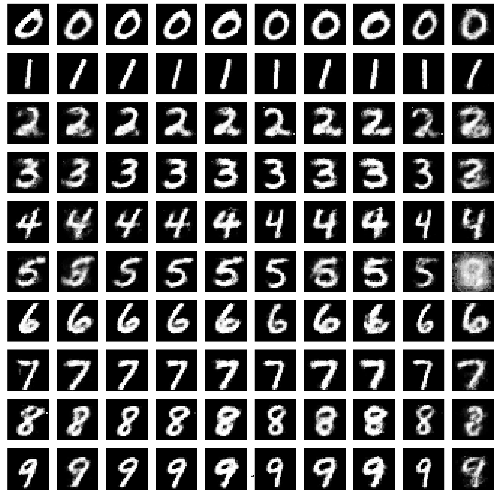

pytorch-cgan-cdcgan-acgan
======================

cGAN
-----------------

# Mnist Result
## Epoch timelapse

<table align='center'>
<tr align='center'>
 <td> Generated image</td>
 </tr>
<tr>
 <td> </td>
</tr>
</table>

<table align='center'>
<tr align='center'>
 <td> Epoch 0 </td>
<td> Epoch 20 </td>
<td> Epoch 40 </td>
<td> Epoch 60 </td>
<td> Epoch 80 </td>
<td> Epoch 100 </td>
 </tr>
<tr>
 <td> </td>
 <td></td>
 <td> </td>
 <td> </td>
 <td></td>
 <td> </td>
</tr>
</table>

### Enviroment
1. epoch : 100, batch size : 100, learning rate : 0.0002 ,activation fuction : ReLU For 
both (generator, discriminator) net , output activation fuction : Sigmoid,

cGAN_split
-----------------

# Mnist Result
## Epoch timelapse

<table align='center'>
<tr align='center'>
 <td> Generated image</td>
 </tr>
<tr>
 <td> </td>
</tr>
</table>

<table align='center'>
<tr align='center'>
 <td> Epoch 0 </td>
<td> Epoch 20 </td>
<td> Epoch 40 </td>
<td> Epoch 60 </td>
<td> Epoch 80 </td>
<td> Epoch 100 </td>
 </tr>
<tr>
 <td> </td>
 <td></td>
 <td> </td>
 <td> </td>
 <td></td>
 <td> </td>
</tr>
</table>

### Enviroment
1. epoch : 100, batch size : 100, learning rate : 0.0002 ,activation fuction : ReLU For 
both (generator, discriminator) net , output activation fuction : Sigmoid,

cDCGAN
-----------------

# Mnist Result
## Epoch timelapse

<table align='center'>
<tr align='center'>
 <td> Generated image</td>
 </tr>
<tr>
 <td> </td>
</tr>
</table>

<table align='center'>
<tr align='center'>
 <td> Epoch 0 </td>
<td> Epoch 5 </td>
<td> Epoch 8 </td>
 </tr>
<tr>
 <td> </td>
 <td></td>
 <td> </td>
</tr>
</table>

### Enviroment
1. epoch : 8, batch size : 32, learning rate : 0.0002 ,activation fuction : ReLU For 
both (generator, discriminator) net , output activation fuction : Sigmoid,

cDCGAN_split
-----------------

# Mnist Result
## Epoch timelapse

<table align='center'>
<tr align='center'>
 <td> Generated image</td>
 </tr>
<tr>
 <td> </td>
</tr>
</table>

<table align='center'>
<tr align='center'>
 <td> Epoch 0 </td>
<td> Epoch 5 </td>
<td> Epoch 8 </td>
 </tr>
<tr>
 <td> </td>
 <td></td>
 <td> </td>
</tr>
</table>

### Enviroment
1. epoch : 8, batch size : 32, learning rate : 0.0002 ,activation fuction : ReLU For 
both (generator, discriminator) net , output activation fuction : Sigmoid,

ACGAN
-----------------

# Mnist Result
## Epoch timelapse

<table align='center'>
<tr align='center'>
 <td> Epoch 0 </td>
<td> Epoch 1 </td>
<td> Epoch 2 </td>
 </tr>
<tr>
 <td> </td>
 <td></td>
 <td> </td>
</tr>
</table>

### Enviroment
1. epoch : 3, batch size : 32, learning rate : 0.0002 ,activation fuction : ReLU For 
both (generator, discriminator) net , output activation fuction : Sigmoid,

### Reference

1. https://github.com/znxlwm/pytorch-MNIST-CelebA-GAN-DCGAN
2. https://github.com/hwalsuklee/tensorflow-generative-model-collections

